# BeatScript

A Chrome extension that automatically extracts song information and lyrics from YouTube videos in real-time.

## Overview

BeatScript is a lightweight extension that enhances your YouTube music experience by automatically detecting and displaying lyrics for music videos. It uses multiple lyrics sources and AI-powered cleaning to provide accurate results.

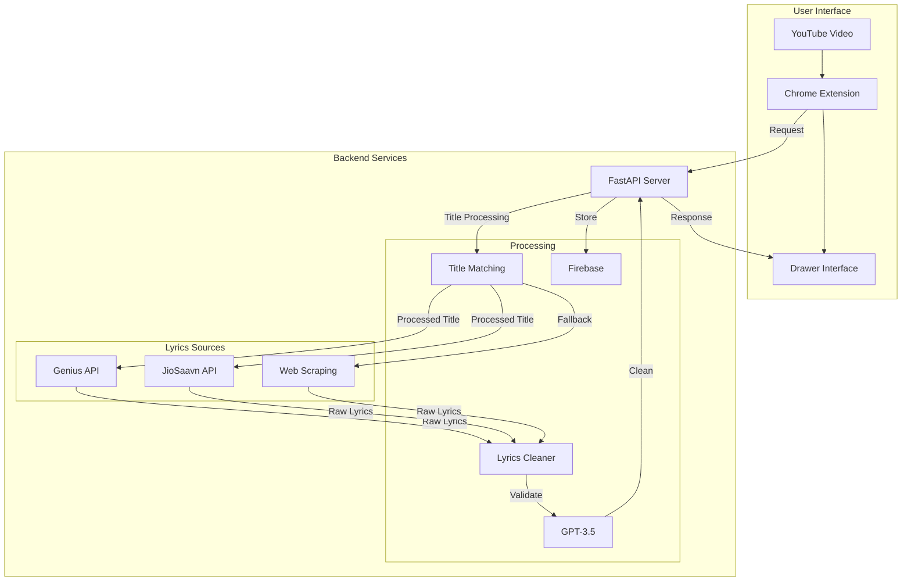

## Features

### Core Functionality
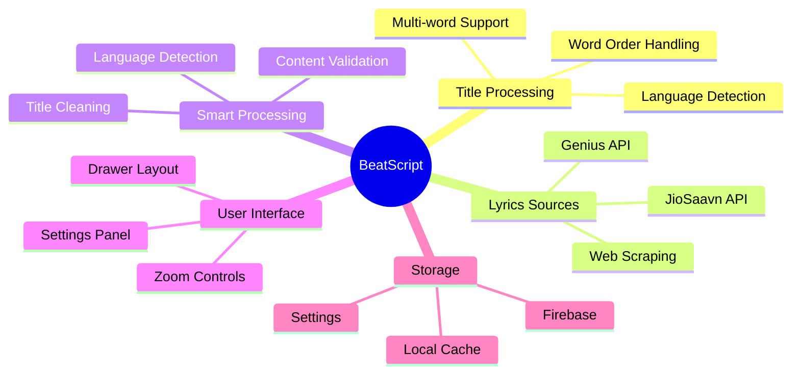

### Data Flow
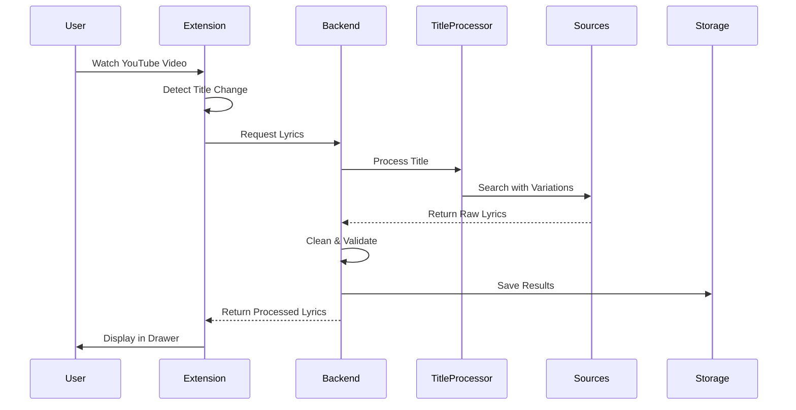

## System Architecture

### Component Interaction
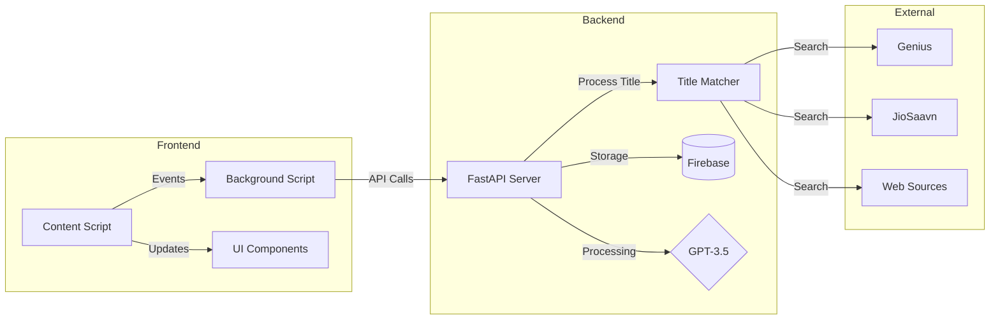

## Prerequisites

- Python 3.8+
- Chrome browser
- Node.js 14+ (for development)

### Environment Setup Flow
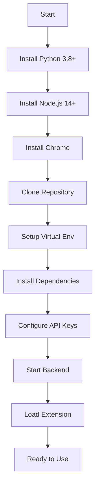

## Required API Keys

Create a `.env` file in the backend directory with:
```
GENIUS_ACCESS_TOKEN=your_token
OPENAI_API_KEY=your_key
FIREBASE_ADMIN_CREDENTIALS=path_to_credentials.json
```

## Installation

### Backend Setup
```bash
cd backend
python -m venv venv
source venv/bin/activate  # On Windows: venv\Scripts\activate
pip install -r requirements.txt
uvicorn main:app --reload
```

### Extension Setup
1. Open Chrome and go to `chrome://extensions/`
2. Enable "Developer mode"
3. Click "Load unpacked"
4. Select the project directory

## Project Structure

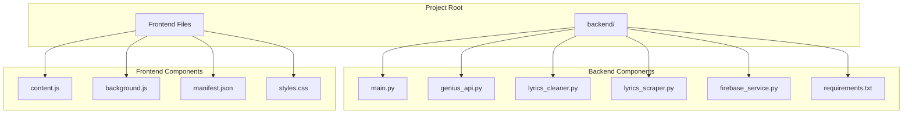

## API Endpoints

### Search Flow
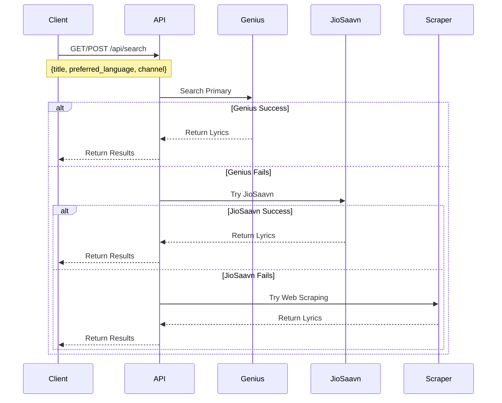

### Storage Operations
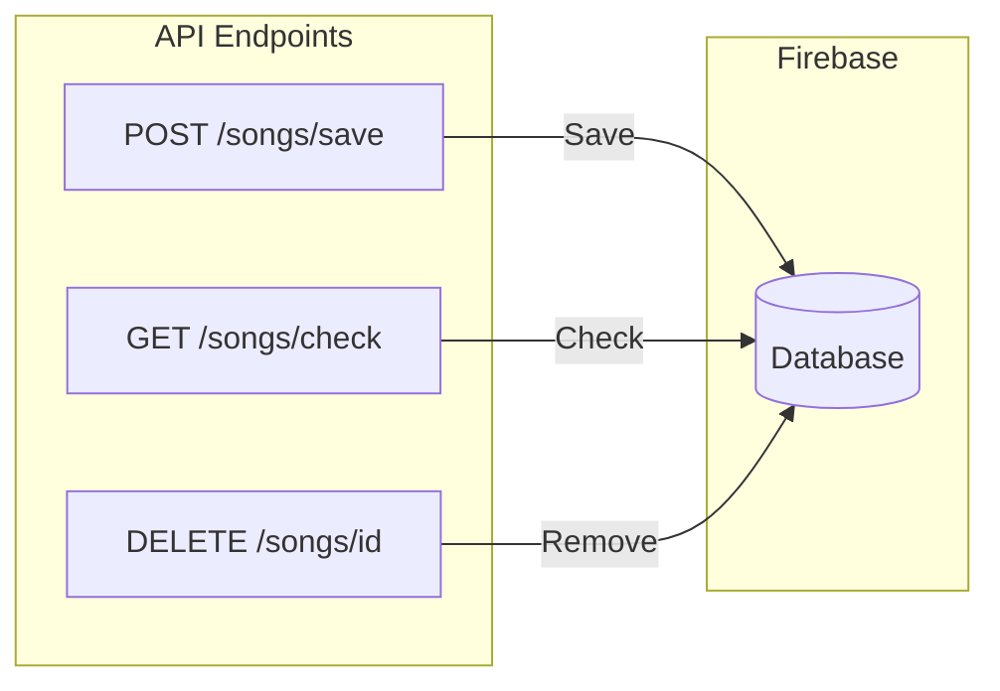

## Development

### Backend Dependencies
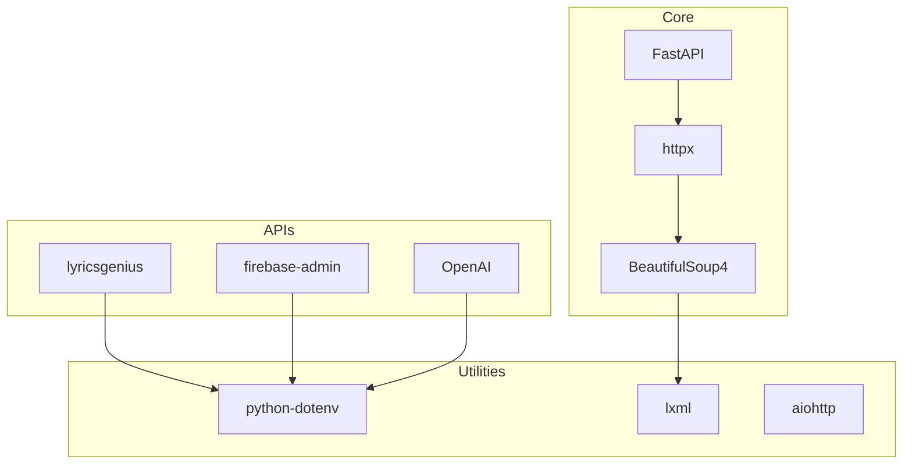

### Extension Features
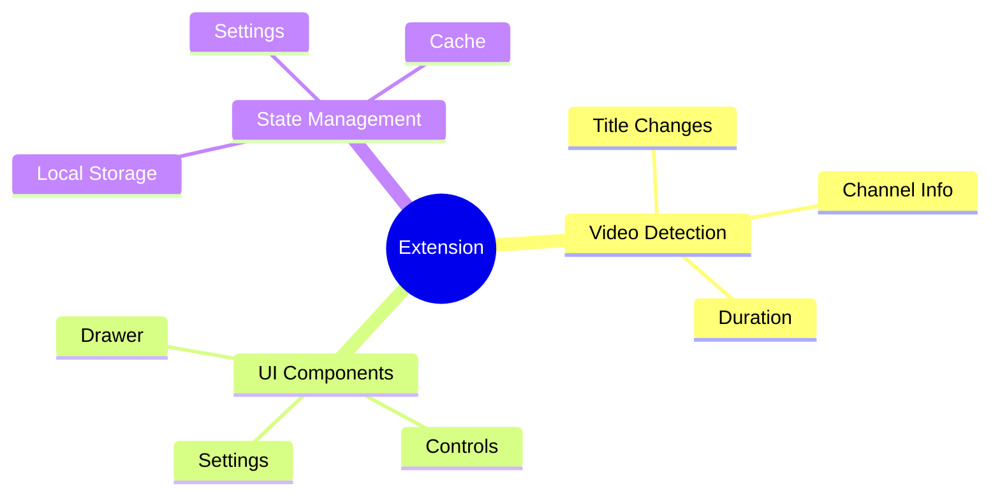

## Error Handling

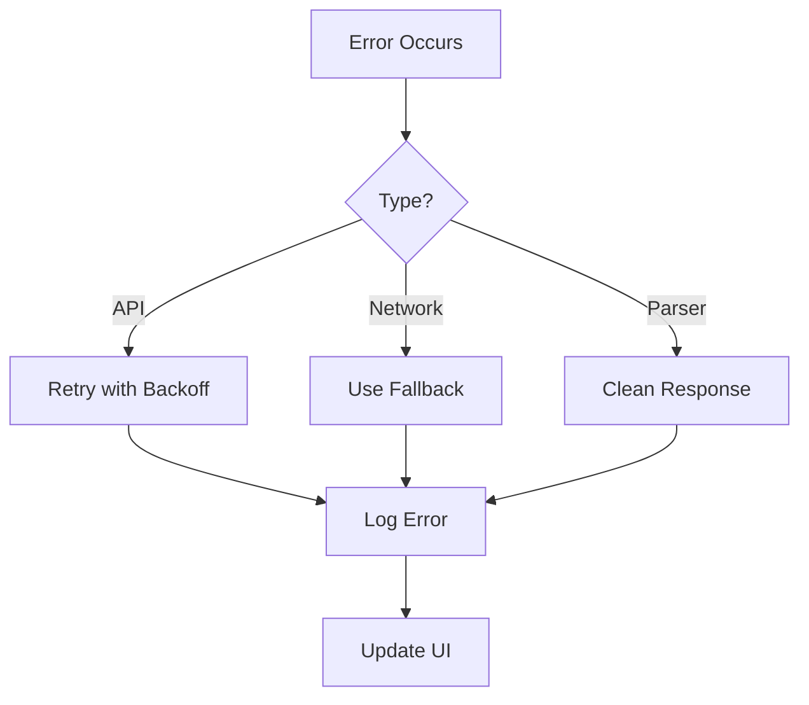

## Contributing

1. Fork the repository
2. Create a feature branch
3. Make your changes
4. Submit a pull request

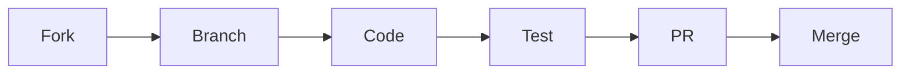

## Performance

### Response Times
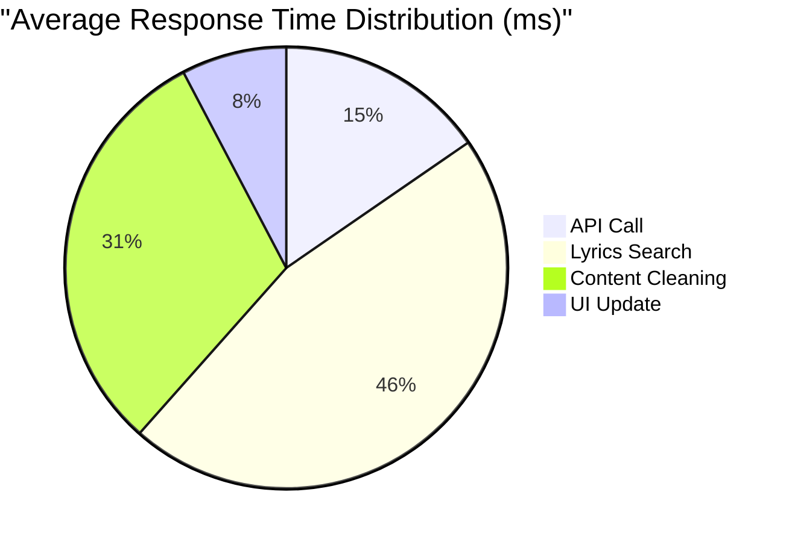

### Success Rates
```mermaid
bar
    title Source Success Rates
    Genius "85%"
    JioSaavn "75%"
    Fallback "60%"
```

## License

MIT License - See LICENSE file for details 

## Known Limitations

### Title Matching
- Multi-word titles may have reduced accuracy when words are jumbled
- Non-English titles may require specific word order
- Single-word titles have highest success rate

### Search Behavior
- Different sources have varying sensitivity to word order
- JioSaavn requires more precise query formatting
- Fallback sources may need multiple search attempts
