# BeatScript - YouTube Music Information Extractor

## Overview
BeatScript is a Chrome extension that automatically extracts song information and lyrics from YouTube videos in real-time, providing a seamless music discovery experience.

## Architecture

### System Components
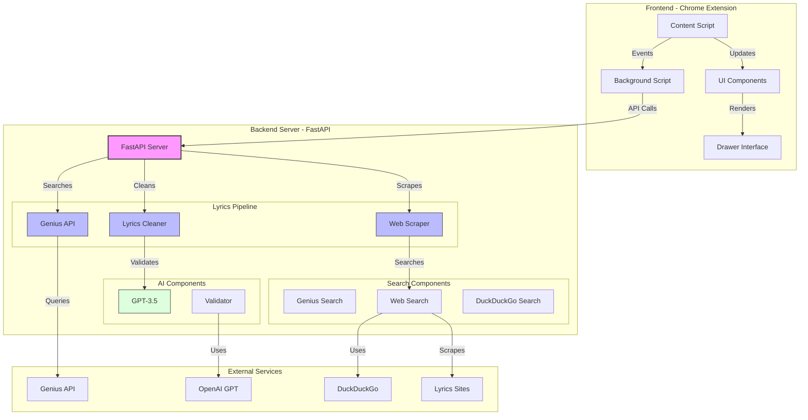

### Data Flow
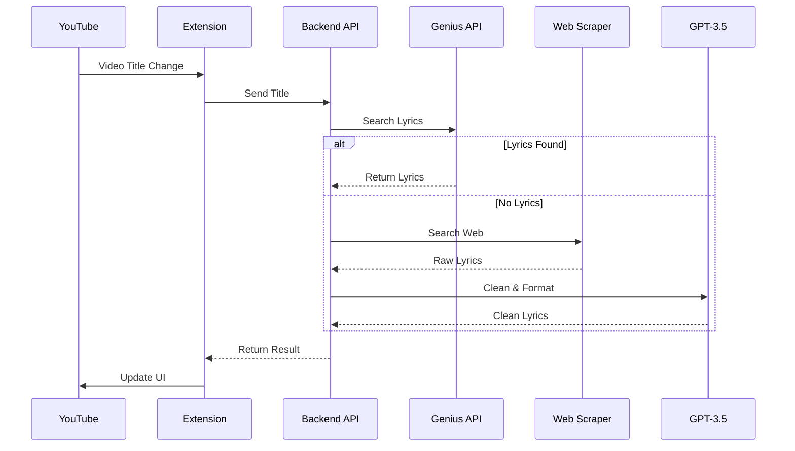

### Component Details

#### Frontend Components
| Component | Purpose | Technologies |
|-----------|----------|--------------|
| Content Script | Video detection & UI injection | JavaScript |
| Background Script | Extension management | JavaScript |
| Drawer Interface | Lyrics display & controls | HTML/CSS |
| Event Handlers | User interaction & state | JavaScript |

#### Backend Components
| Component | Purpose | Technologies |
|-----------|----------|--------------|
| FastAPI Server | Main API endpoint | Python/FastAPI |
| Genius Integration | Primary lyrics source | Python/lyricsgenius |
| Web Scraper | Backup lyrics source | Python/BeautifulSoup |
| GPT Integration | Content cleaning | OpenAI API |

### Lyrics Search Flow
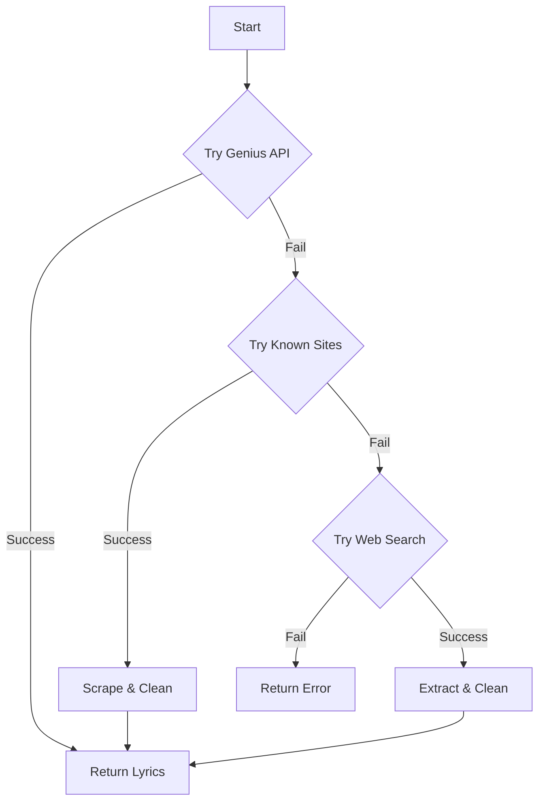

### UI Components
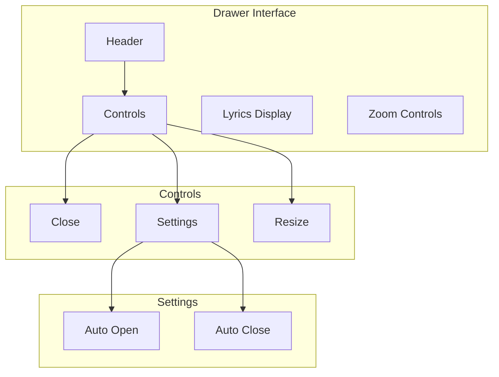

## Features

### Core Functionality
- ✅ Automatic video detection
- ✅ Real-time lyrics extraction
- ✅ Multi-source lyrics search
- ✅ Intelligent content cleaning
- ✅ Language detection & handling

### UI/UX Features
- ✅ Resizable drawer interface
- ✅ Zoom controls
- ✅ Auto-open/close settings
- ✅ Smooth animations
- ✅ Responsive design

## Technical Stack

### Frontend
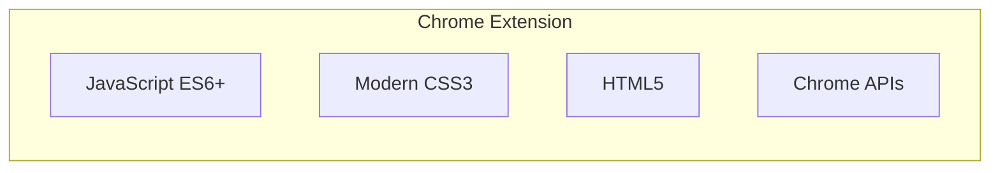

### Backend
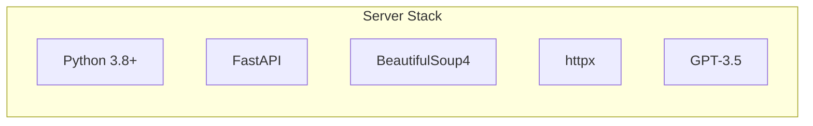

## Installation

### Prerequisites
```bash
# Required
- Python 3.8+
- Chrome browser
- Node.js 14+

# API Keys
- GENIUS_ACCESS_TOKEN
- OPENAI_API_KEY
```

### Setup Steps
1. Clone repository
2. Install backend dependencies
3. Configure environment variables
4. Load extension in Chrome
5. Start backend server

## API Endpoints

### Main Search Endpoint
```typescript
GET/POST /api/search
Parameters:
- title: string
- preferred_language?: string

Response:
{
    song: string
    artist: string
    type: "lyrical" | "instrumental" | "error"
    lyrics?: string
    error?: string
}
```

## Performance Metrics

### Response Times
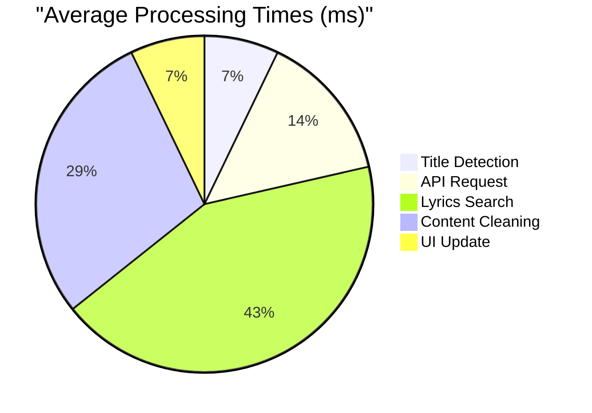

### Success Rates
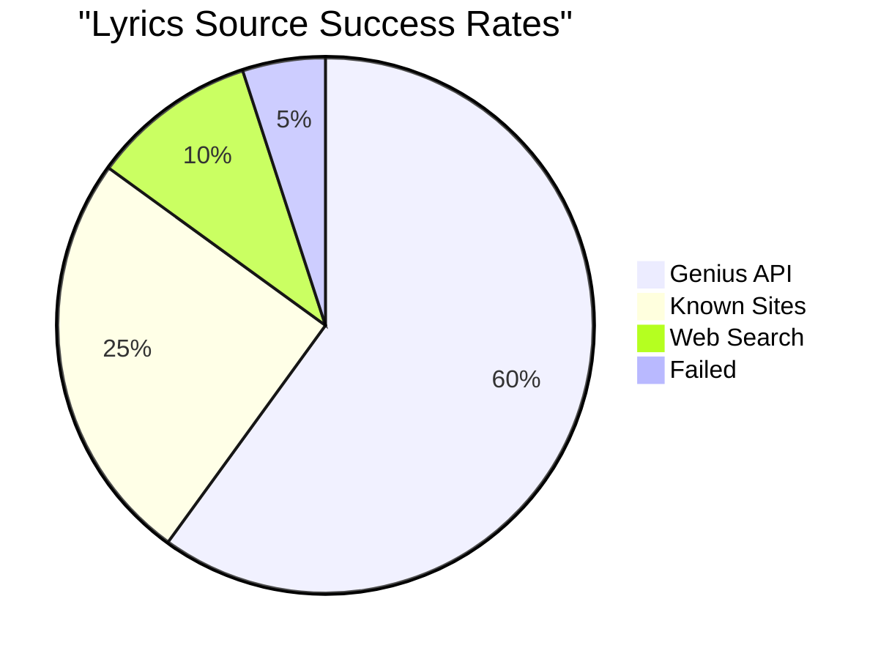

## Error Handling

### Error Flow
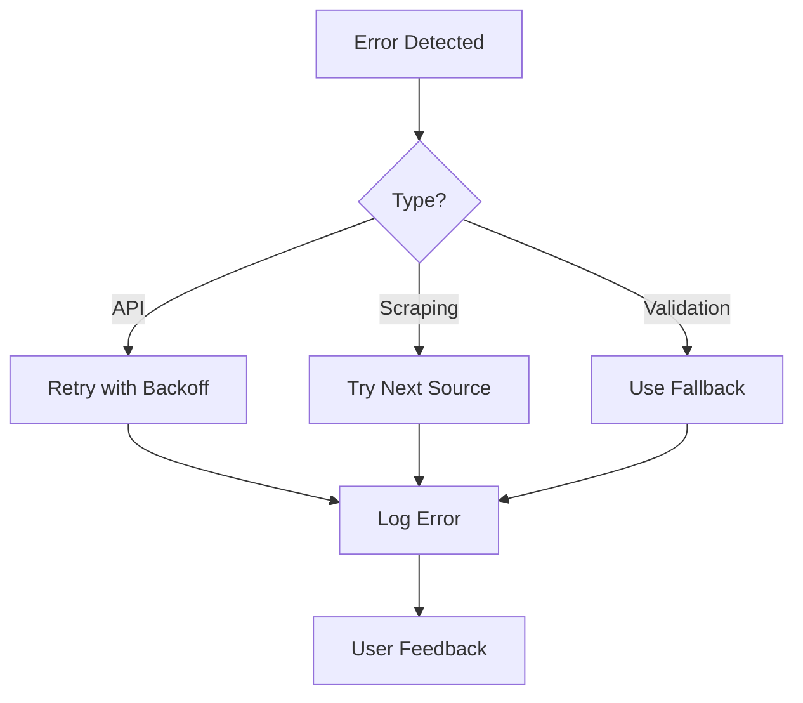

## Security Measures

### Implementation
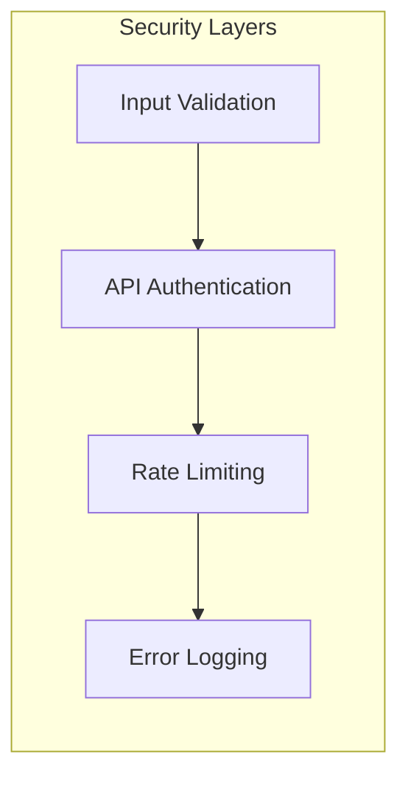

## Testing Strategy

### Test Coverage
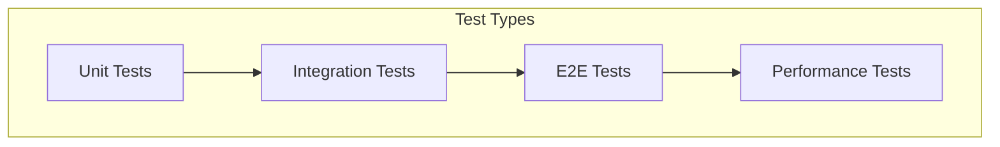

## Future Roadmap

### Planned Features
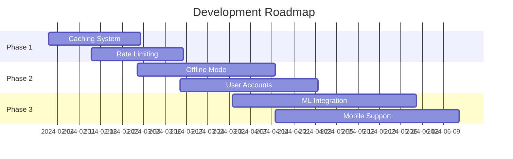