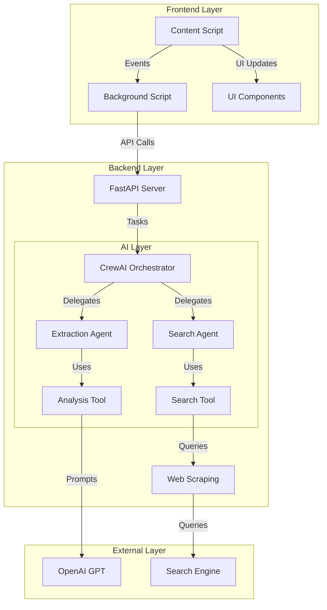
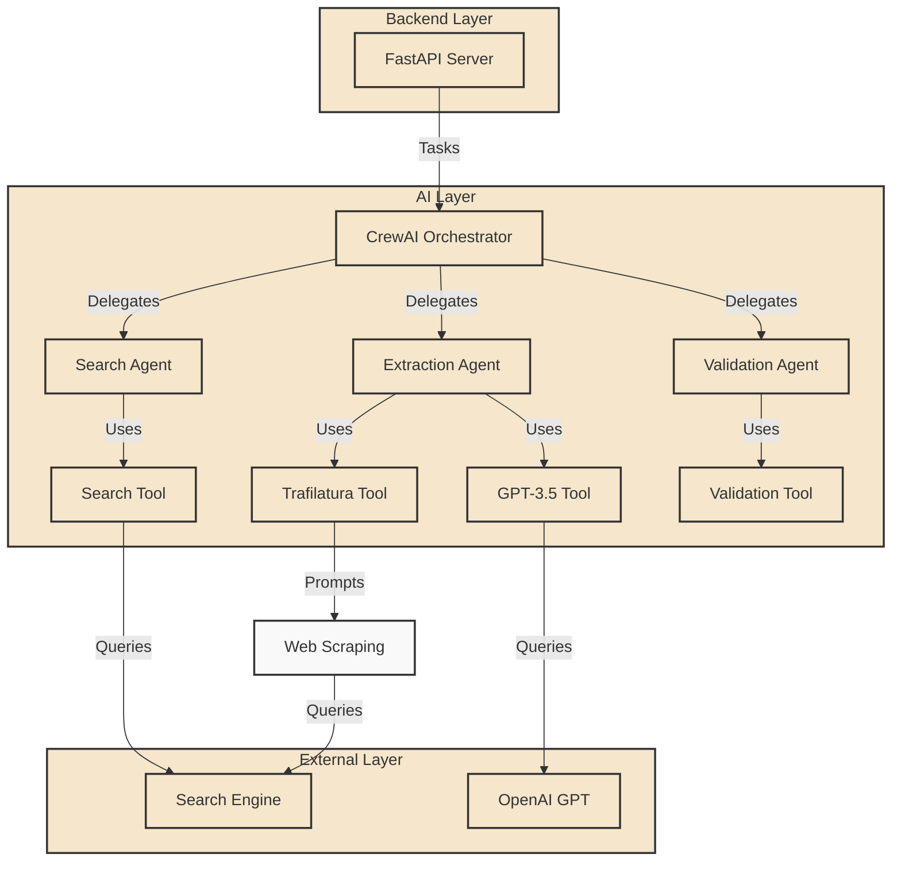
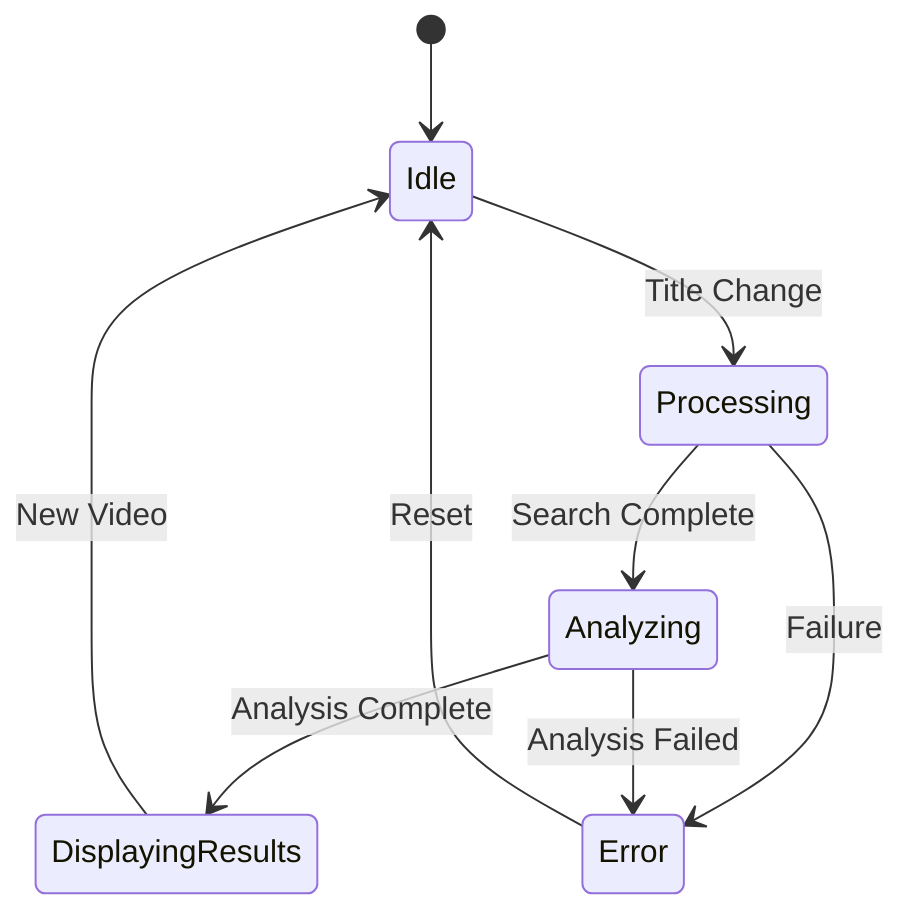

# BeatScript 


> A sophisticated Chrome extension for intelligent music detection and metadata extraction from YouTube videos.

## Table of Contents
- [Overview](#overview)
- [Why BeatScript?](#why-beatscript)
- [System Architecture](#system-architecture)
- [Design Philosophy](#design-philosophy)
- [Technical Implementation](#technical-implementation)
- [Installation](#installation)
- [Development](#development)

## Overview

BeatScript is an intelligent Chrome extension that seamlessly extracts and identifies song information from YouTube videos. By combining modern web technologies with AI capabilities, it provides real-time music metadata detection with high accuracy and minimal latency.

## Why BeatScript?

### The Problem
YouTube hosts millions of music videos, but their titles often follow inconsistent patterns:
- Varying formats (Artist - Song, Song by Artist, etc.)
- Multiple languages and transliterations
- Additional metadata in titles (Official Video, Lyrics, etc.)
- Remixes, covers, and live versions
- Featuring artists and collaborations

### The Solution
BeatScript employs a multi-agent AI system to:
1. Intelligently parse video titles
2. Cross-reference with search engines
3. Validate song information
4. Present clean, standardized metadata

### Key Differentiators
- **Intelligent Processing**: Uses AI to understand context and variations
- **Real-time Detection**: Immediate updates as users browse
- **High Accuracy**: Multi-stage verification process
- **Clean UI**: Non-intrusive, responsive drawer interface
- **Stateful**: Maintains context across page navigation

## System Architecture

### High-Level Design


LYRICS UPDATE:


### Component Architecture

#### Frontend Components
1. **Content Script**
   - YouTube DOM monitoring
   - Title change detection
   - State management
   - Event handling

2. **Background Script**
   - Cross-page state persistence
   - API communication
   - Extension lifecycle management

3. **UI Components**
   - Responsive drawer interface
   - Real-time updates
   - Settings management
   - Error handling

#### Backend Components
1. **FastAPI Server**
   - RESTful endpoints
   - Request validation
   - Response formatting
   - Error handling

2. **CrewAI System**
   - Task orchestration
   - Agent management
   - Tool coordination
   - Result validation

3. **Web Scraping**
   - Search engine integration
   - Result parsing
   - Rate limiting
   - Error recovery

## Design Philosophy

### Core Principles
1. **Modularity**: Each component has a single responsibility
2. **Resilience**: Graceful handling of failures
3. **Performance**: Minimal impact on YouTube browsing
4. **Accuracy**: Multi-stage verification process
5. **User Experience**: Non-intrusive yet accessible

### State Management


### Data Flow
1. **Title Detection**
   - DOM mutation observation
   - Debounced updates
   - State validation

2. **Processing Pipeline**
   - Title normalization
   - Search execution
   - Result analysis
   - Metadata extraction

3. **Result Handling**
   - Confidence scoring
   - Format standardization
   - UI updates
   - Error reporting

## Technical Implementation

### AI System Design
1. **CrewAI Orchestrator**
   - Task decomposition
   - Agent coordination
   - Result aggregation
   - Error handling

2. **Specialized Agents**
   - Search optimization
   - Pattern recognition
   - Context understanding
   - Metadata extraction

3. **Custom Tools**
   - Web search integration
   - GPT prompt engineering
   - Result validation
   - Format standardization

### Performance Optimizations
1. **Frontend**
   - Event debouncing
   - State caching
   - Lazy loading
   - Resource cleanup

2. **Backend**
   - Request batching
   - Response caching
   - Async processing
   - Connection pooling

3. **AI Processing**
   - Prompt optimization
   - Result caching
   - Parallel processing
   - Early termination

## Installation

### Prerequisites
- Chrome Browser (v80+)
- Python 3.8+
- Node.js 14+
- OpenAI API Key

### Quick Start
1. Clone the repository
```bash
git clone https://github.com/yourusername/beatscript.git
```

2. Install dependencies
```bash
# Backend
cd backend
pip install -r requirements.txt

# Frontend
cd ../frontend
npm install
```

3. Configure environment
```bash
cp .env.example .env
# Edit .env with your API keys
```

4. Run development servers
```bash
# Backend
python main.py

# Frontend
npm run dev
```

## Development

### Architecture Decisions
- **Chrome Extension**: Direct DOM access and real-time updates
- **FastAPI**: Async support and modern Python features
- **CrewAI**: Sophisticated AI task orchestration
- **DuckDuckGo**: Privacy-focused search integration

### Best Practices
1. **Code Organization**
   - Feature-based structure
   - Clear separation of concerns
   - Comprehensive documentation
   - Type annotations

2. **Testing Strategy**
   - Unit tests for core logic
   - Integration tests for API
   - E2E tests for workflows
   - Performance benchmarks

3. **Security Measures**
   - API key protection
   - Input sanitization
   - Rate limiting
   - Error logging

---

## License
MIT © [BeatScript]

## Contributing
Please read [CONTRIBUTING.md](CONTRIBUTING.md) for details on our code of conduct and the process for submitting pull requests. 
