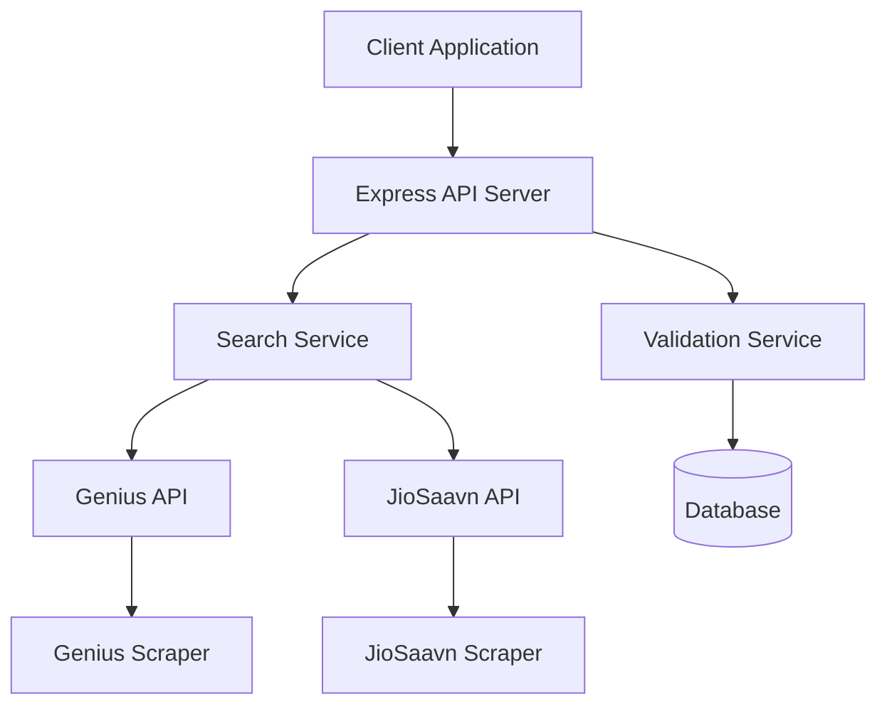
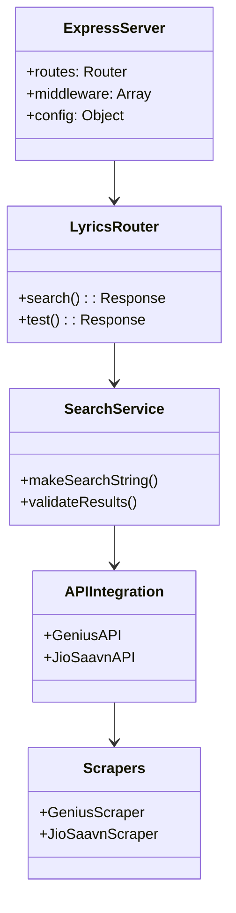
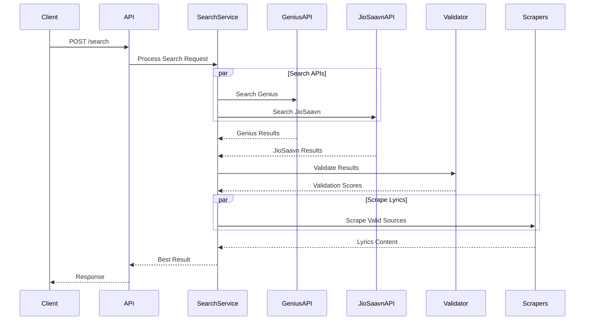
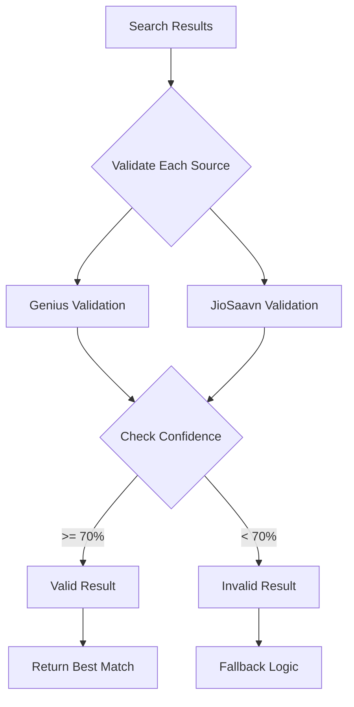
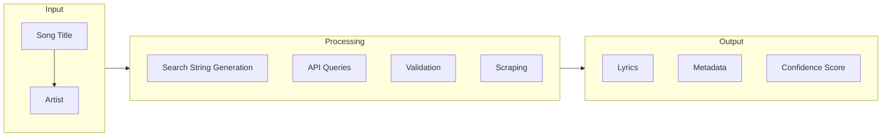
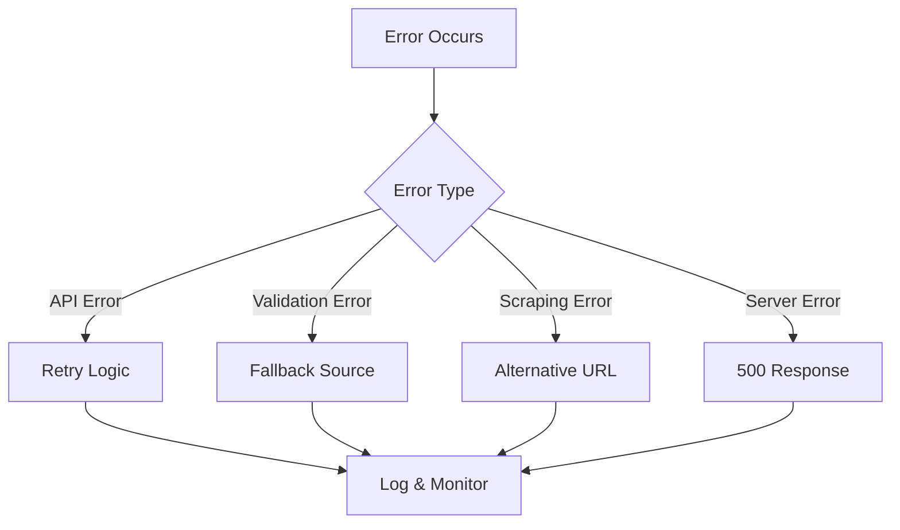
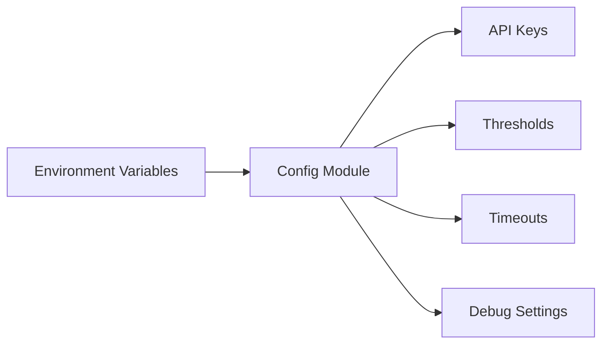
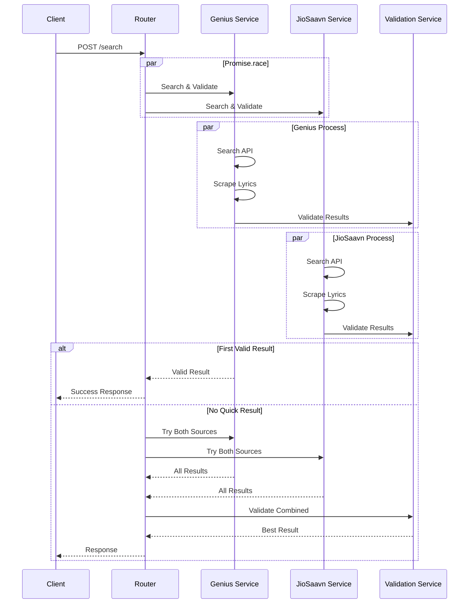

# BeatScript Architecture Documentation

## System Overview

BeatScript is a lyrics search and retrieval system that integrates multiple sources (Genius and JioSaavn) to provide accurate song lyrics. The system employs parallel processing, validation, and intelligent search strategies to ensure reliable results.

## High-Level Architecture

## Component Details

### 1. Server Components

### 2. Search Flow

### 3. Validation Process

## Key Components

1. **Express Server**
   - Main entry point
   - Route handling
   - Error management
   - Configuration management

2. **Search Service**
   - Search string generation
   - Multi-source search coordination
   - Result aggregation
   - Parallel processing

3. **API Integrations**
   - Genius API client
   - JioSaavn API client
   - Rate limiting
   - Error handling

4. **Scrapers**
   - HTML parsing
   - Lyrics extraction
   - Error recovery
   - Content validation

5. **Validation Service**
   - Confidence scoring
   - Result ranking
   - Quality assurance
   - Threshold management

## Data Flow

## Error Handling

## Configuration Management

## Performance Considerations

1. **Parallel Processing**
   - API calls executed simultaneously
   - Validation runs in parallel
   - Scraping performed concurrently

2. **Caching Strategy**
   - Results caching
   - API response caching
   - Validation score caching

3. **Error Recovery**
   - Graceful degradation
   - Multiple fallback options
   - Comprehensive logging

## Security Measures

1. **API Security**
   - Token management
   - Rate limiting
   - Request validation

2. **Data Validation**
   - Input sanitization
   - Output escaping
   - Content verification

## Monitoring and Logging

1. **Debug Mode**
   - Detailed logging
   - Performance metrics
   - Error tracking

2. **Health Checks**
   - API status monitoring
   - Service availability
   - Response times

## Future Improvements

1. **Scalability**
   - Load balancing
   - Service clustering
   - Cache distribution

2. **Features**
   - Additional lyrics sources
   - Enhanced validation
   - Machine learning integration

