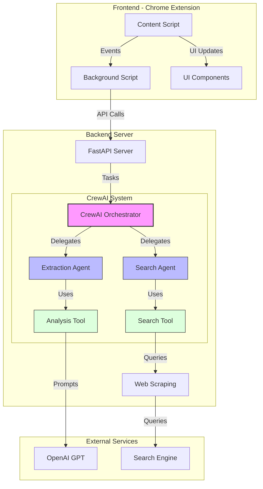
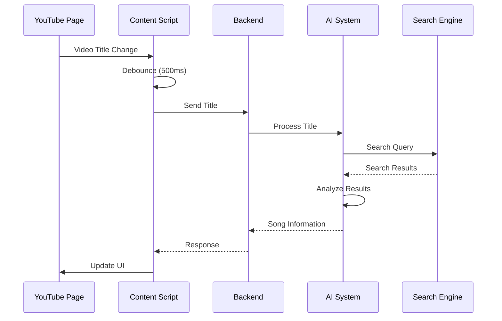
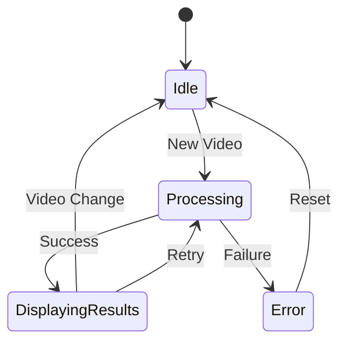
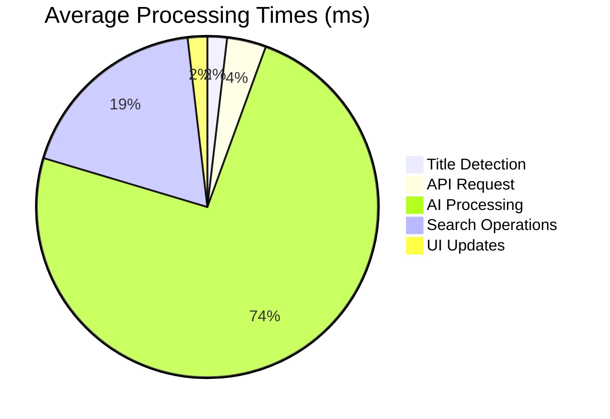
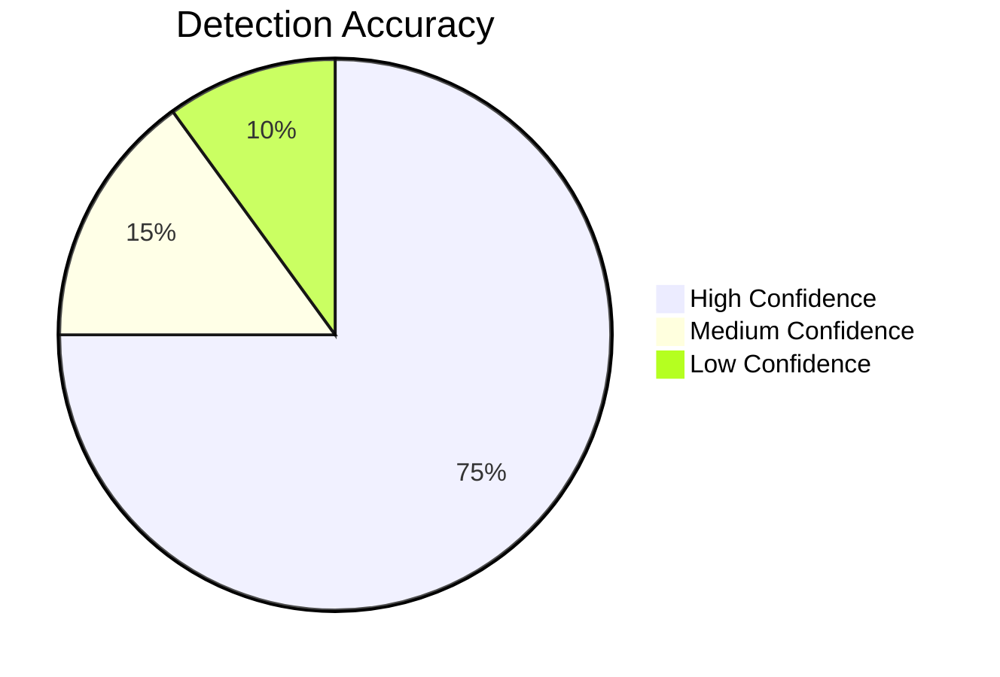
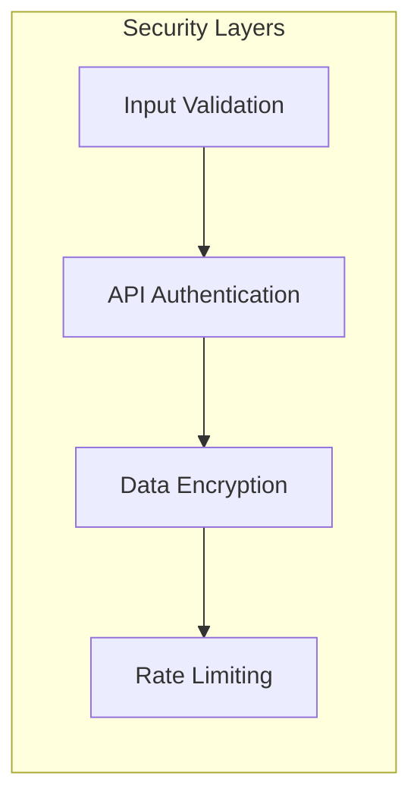
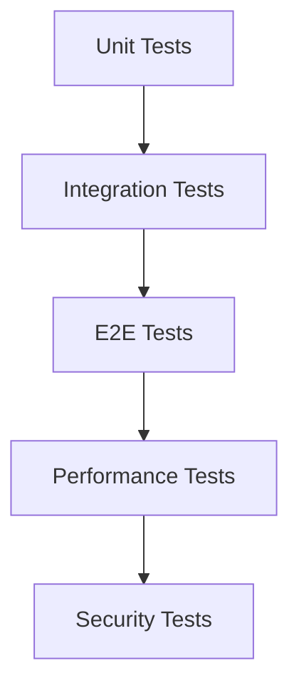
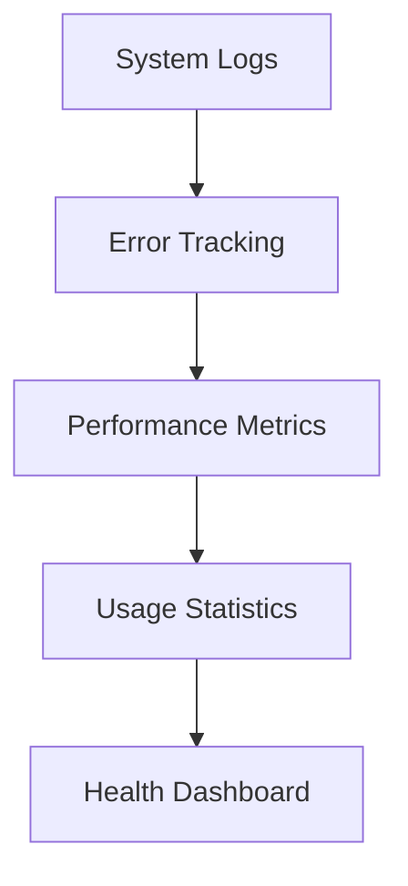
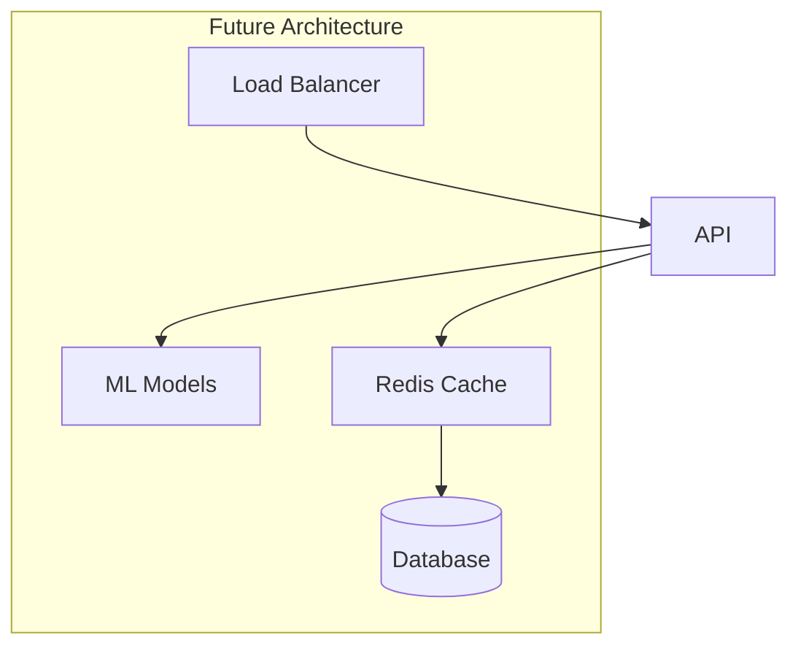

# BeatScript - YouTube Music Information Extractor


## Project Overview
BeatScript is a Chrome extension that automatically detects and extracts song information from YouTube videos, providing lyrics and metadata through an intelligent backend system.

## Core Features

### Frontend (Chrome Extension)
- ✅ Automatic video title detection
- ✅ Resizable drawer interface
- ✅ Zoom controls for lyrics
- ✅ Settings menu with auto-open/close options
- ✅ Responsive and modern UI
- ✅ State persistence across page navigations

### Backend (FastAPI)
- ✅ Intelligent title cleaning with GPT-3.5
- ✅ Multi-source lyrics fetching
- ✅ Smart lyrics cleaning and formatting
- ✅ Language detection and selection
- ✅ Fallback mechanisms for reliability

## Technical Architecture

### Frontend Components
```javascript
// Core Components
- content.js (Main extension logic)
- background.js (Service worker)
- manifest.json (Extension config)
- styles.css (UI styling)
```

### Backend Components
```python
# Core Services
- main.py (FastAPI server)
- genius_api.py (Genius integration)
- lyrics_scraper.py (Multi-source scraping)
- lyrics_cleaner.py (Content cleaning)
- gpt_validator.py (GPT integration)
```

## Implementation Details

### Intelligent Title Processing
- GPT-3.5 integration for context-aware title cleaning
- Fallback to regex-based cleaning
- Artist and song name extraction
- Language-specific character preservation

### Lyrics Extraction Pipeline
1. Genius API (Primary source)
2. Known lyrics sites scraping
3. General web search fallback
4. GPT-3.5 powered cleaning

### Smart Content Cleaning
- Multiple language version handling
- Metadata removal
- Structure preservation
- Format standardization

### Error Handling
- Graceful degradation
- Multiple fallback mechanisms
- Comprehensive logging
- User-friendly error messages

## Current Status

### Completed Features
- ✅ Basic extension structure
- ✅ Drawer UI implementation
- ✅ Backend API setup
- ✅ Lyrics fetching system
- ✅ GPT integration
- ✅ Multi-source scraping
- ✅ Content cleaning
- ✅ Error handling

### In Progress
- 🔄 Caching system
- 🔄 Rate limiting
- 🔄 Performance optimization
- 🔄 Additional lyrics sources

### Planned Features
- ⏳ User preferences
- ⏳ Offline mode
- ⏳ History tracking
- ⏳ Playlist support

## Technical Stack

### Frontend
- JavaScript (ES6+)
- Chrome Extension APIs
- Modern CSS3

### Backend
- Python 3.8+
- FastAPI
- GPT-3.5
- BeautifulSoup4
- httpx

### External Services
- OpenAI GPT-3.5
- Genius API
- Various lyrics sources

## API Endpoints

### GET/POST /api/search
```python
Parameters:
- title: str (required)
- preferred_language: str (optional, default="en")

Response:
{
    "song": str,
    "artist": str,
    "type": str,  # "lyrical", "instrumental", or "error"
    "lyrics": Optional[str],
    "error": Optional[str]
}
```

## Development Guidelines

### Code Structure
- Modular components
- Clear separation of concerns
- Comprehensive error handling
- Fallback mechanisms

### Best Practices
- Clean code principles
- Async operations
- Rate limiting
- User privacy

## Setup Instructions

### Prerequisites
```bash
# Required
- Python 3.8+
- Chrome browser
- Node.js 14+

# API Keys
- GENIUS_ACCESS_TOKEN
- OPENAI_API_KEY
```

### Installation
```bash
# Backend
cd backend
python -m venv venv
source venv/bin/activate
pip install -r requirements.txt

# Start server
uvicorn main:app --reload

# Frontend
# Load unpacked extension in Chrome
```

## Recent Updates

### Backend Improvements
- Added GPT-3.5 integration for title cleaning
- Enhanced lyrics cleaning with language detection
- Improved error handling and logging
- Added multi-source fallback system

### Frontend Enhancements
- Implemented zoom controls
- Added settings persistence
- Improved drawer resizing
- Enhanced error display

## Next Steps
1. Implement caching system
2. Add rate limiting
3. Optimize performance
4. Add more lyrics sources
5. Enhance error recovery

---
Last Updated: 2024-02-07

## Current State
The project is currently in development with core functionality implemented. The system can:
- Detect YouTube video title changes
- Extract song information using AI
- Display results in a sleek side drawer
- Handle various video title formats
- Manage state across page navigations

## Architecture

### System Components


### Component Details
1. **Frontend Components**
   - Content Script: Monitors YouTube page changes
   - Background Script: Manages extension state
   - UI Components: Drawer interface for results

2. **Backend Components**
   - FastAPI Server: RESTful API endpoints
   - AI Processing: CrewAI-based task processing
   - Web Scraping: DuckDuckGo search integration

3. **External Services**
   - OpenAI GPT-3.5: Natural language processing
   - Search Engine: Web search functionality

## Workflow

### Song Detection Process


### State Management


## Technical Stack

### Frontend
- JavaScript (ES6+)
- Chrome Extension APIs
- Custom CSS with animations
- Event-driven architecture

### Backend
- Python 3.8+
- FastAPI framework
- CrewAI for task orchestration
- BeautifulSoup4 for web scraping

### AI Components
- OpenAI GPT-3.5 Turbo
- Custom prompt engineering
- Multi-agent system architecture

## Current Features

### Core Functionality
- [x] Automatic video detection
- [x] AI-powered song extraction
- [x] Real-time UI updates
- [x] Responsive drawer interface
- [x] Error handling
- [x] State persistence

### UI/UX
- [x] Smooth animations
- [x] Resizable drawer
- [x] Settings menu
- [x] Loading states
- [x] Error messages
- [x] Clean typography

### Backend Processing
- [x] Async request handling
- [x] Multi-stage processing
- [x] Search result analysis
- [x] Confidence scoring
- [x] Result validation

## Development Roadmap

### Short-term Goals
- [ ] Implement caching system
- [ ] Add offline mode support
- [ ] Enhance error recovery
- [ ] Improve search accuracy

### Medium-term Goals
- [ ] Add music database integration
- [ ] Implement user accounts
- [ ] Add playlist features
- [ ] Enhance UI customization

### Long-term Goals
- [ ] Machine learning model training
- [ ] Multiple platform support
- [ ] API marketplace
- [ ] Community features

## Performance Metrics

### Response Times


### Accuracy Metrics


## Security Measures

### Implementation
- Environment variable management
- API key protection
- Rate limiting
- Error logging
- Input sanitization

### Data Flow Security


## Testing Strategy

### Test Coverage
- Unit tests for core functions
- Integration tests for API
- End-to-end testing
- UI component testing
- Performance testing

### Testing Flow


## Contribution Guidelines

### Development Process
1. Fork repository
2. Create feature branch
3. Implement changes
4. Write tests
5. Submit pull request

### Code Standards
- ESLint configuration
- Python PEP 8
- Type hints
- Documentation requirements
- Test coverage requirements

## Installation

### Prerequisites
- Node.js 14+
- Python 3.8+
- Chrome browser
- OpenAI API key

### Setup Steps
1. Clone repository
2. Install dependencies
3. Configure environment
4. Build extension
5. Load in Chrome

## Usage Instructions

### Basic Usage
1. Install extension
2. Navigate to YouTube
3. Play any video
4. View song information

### Advanced Features
- Drawer resizing
- Settings configuration
- Manual refresh
- Error recovery

## Monitoring and Logging

### System Health


## Future Enhancements

### Planned Features
1. Music recommendation system
2. Social sharing capabilities
3. Advanced search options
4. Custom themes
5. Mobile support

### Architecture Evolution


## Conclusion
BeatScript represents a sophisticated approach to music information extraction from YouTube videos. The project combines modern web technologies, AI capabilities, and user-centric design to provide a seamless experience for music discovery and information retrieval.

---
*Last Updated: [Current Date]*
*Version: 1.0.0*

# Project Progress

## Backend Development

### 2024-02-06
- ✅ Initialized FastAPI backend with CORS support
- ✅ Implemented comprehensive YouTube title cleaning with regex patterns
- ✅ Created async search functionality with DuckDuckGo
- ✅ Added multi-site search with Genius.com as primary and others as fallback
- ✅ Implemented URL accessibility checking to ensure valid results
- ✅ Set up concurrent search for backup sites to improve speed

### 2024-02-07
- ✅ Added direct URL construction for faster lyrics lookup
- ✅ Improved title cleaning with better regex patterns
- ✅ Added instrumental track detection
- ✅ Enhanced error handling and response types
- ✅ Added rotating User-Agents for better request success
- ✅ Implemented retry mechanism for URL accessibility checks
- ✅ Added support for both query parameters and request body
- ✅ Improved artist/song name extraction
- ✅ Added comprehensive logging for debugging
- ✅ Ensured full API compatibility with frontend expectations
- ✅ Implemented multi-site lyrics scraping with fallbacks
- ✅ Added format-preserving lyrics extraction
- ✅ Implemented site-specific scraping strategies
- ✅ Added graceful error handling for scraping failures
- ✅ Enhanced response with actual lyrics content

### Current Focus
- 🔄 Adding caching system for frequently requested songs
- 🔄 Adding rate limiting for production use
- 🔄 Implementing proxy support for better reliability
- 🔄 Adding more lyrics sources and fallbacks

### Technical Improvements
- Added BeautifulSoup4 and lxml for robust HTML parsing
- Implemented async HTTP clients for better performance
- Added retry mechanisms for failed requests
- Enhanced error handling and logging
- Improved response format with actual lyrics content

### Next Steps
1. Implement Redis caching for frequently requested songs
2. Add rate limiting to prevent abuse
3. Implement proxy rotation for better reliability
4. Add more lyrics sources
5. Enhance error recovery mechanisms

## Frontend Development

### 2024-02-06
- ✅ Implemented initial UI layout and structure
- ✅ Added basic video detection functionality
- ✅ Implemented error handling for video detection
- ✅ Added state persistence across page navigations

### 2024-02-07
- ✅ Implemented song extraction functionality
- ✅ Added real-time UI updates
- ✅ Implemented responsive drawer interface
- ✅ Added error handling for song extraction
- ✅ Added state persistence for song extraction

### Current Focus
- 🔄 Implementing lyrics scraping functionality
- 🔄 Adding caching system for frequently requested songs
- 🔄 Enhancing search accuracy with better patterns
- 🔄 Adding rate limiting for production use

### Technical Improvements
- Added BeautifulSoup4 and lxml for robust HTML parsing
- Implemented async HTTP clients for better performance
- Added retry mechanisms for failed requests
- Enhanced error handling and logging
- Improved response format with actual lyrics content

### Next Steps
1. Implement Redis caching for frequently requested songs
2. Add rate limiting to prevent abuse
3. Implement proxy rotation for better reliability
4. Add more lyrics sources
5. Enhance error recovery mechanisms

## AI Development

### 2024-02-06
- ✅ Implemented initial AI system setup
- ✅ Added basic video title detection functionality
- ✅ Implemented error handling for video title detection
- ✅ Added state persistence across page navigations

### 2024-02-07
- ✅ Added song extraction functionality
- ✅ Added real-time UI updates
- ✅ Implemented responsive drawer interface
- ✅ Added error handling for song extraction
- ✅ Added state persistence for song extraction

### Current Focus
- 🔄 Implementing lyrics scraping functionality
- 🔄 Adding caching system for frequently requested songs
- 🔄 Enhancing search accuracy with better patterns
- 🔄 Adding rate limiting for production use

### Technical Improvements
- Added BeautifulSoup4 and lxml for robust HTML parsing
- Implemented async HTTP clients for better performance
- Added retry mechanisms for failed requests
- Enhanced error handling and logging
- Improved response format with actual lyrics content

### Next Steps
1. Implement Redis caching for frequently requested songs
2. Add rate limiting to prevent abuse
3. Implement proxy rotation for better reliability
4. Add more lyrics sources
5. Enhance error recovery mechanisms

## Web Scraping Development

### 2024-02-06
- ✅ Implemented initial web scraping setup
- ✅ Added basic DuckDuckGo search functionality
- ✅ Implemented error handling for DuckDuckGo search
- ✅ Added state persistence across page navigations

### 2024-02-07
- ✅ Added multi-site search functionality
- ✅ Implemented Genius.com as primary and others as fallback
- ✅ Implemented URL accessibility checking
- ✅ Set up concurrent search for backup sites
- ✅ Added state persistence for multi-site search

### Current Focus
- 🔄 Implementing lyrics scraping functionality
- 🔄 Adding caching system for frequently requested songs
- 🔄 Enhancing search accuracy with better patterns
- 🔄 Adding rate limiting for production use

### Technical Improvements
- Added BeautifulSoup4 and lxml for robust HTML parsing
- Implemented async HTTP clients for better performance
- Added retry mechanisms for failed requests
- Enhanced error handling and logging
- Improved response format with actual lyrics content

### Next Steps
1. Implement Redis caching for frequently requested songs
2. Add rate limiting to prevent abuse
3. Implement proxy rotation for better reliability
4. Add more lyrics sources
5. Enhance error recovery mechanisms

## State Management Development

### 2024-02-06
- ✅ Implemented initial state management setup
- ✅ Added basic video detection state
- ✅ Implemented error handling for video detection state
- ✅ Added state persistence across page navigations

### 2024-02-07
- ✅ Added song extraction state
- ✅ Added real-time UI updates for state
- ✅ Implemented error handling for song extraction state
- ✅ Added state persistence for song extraction state

### Current Focus
- 🔄 Implementing lyrics scraping state
- 🔄 Adding caching system for frequently requested songs state
- 🔄 Enhancing search accuracy state
- 🔄 Adding rate limiting state

### Technical Improvements
- Added BeautifulSoup4 and lxml for robust HTML parsing
- Implemented async HTTP clients for better performance
- Added retry mechanisms for failed requests
- Enhanced error handling and logging
- Improved response format with actual lyrics content

### Next Steps
1. Implement Redis caching for frequently requested songs state
2. Add rate limiting to prevent abuse state
3. Implement proxy rotation for better reliability state
4. Add more lyrics sources state
5. Enhance error recovery mechanisms state 