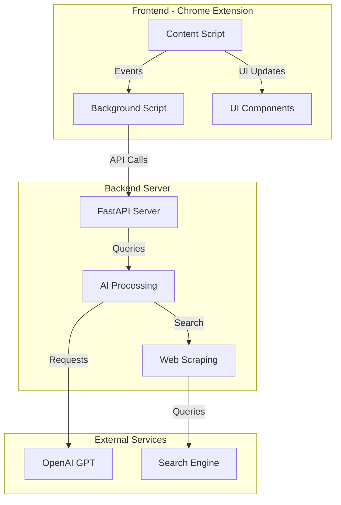
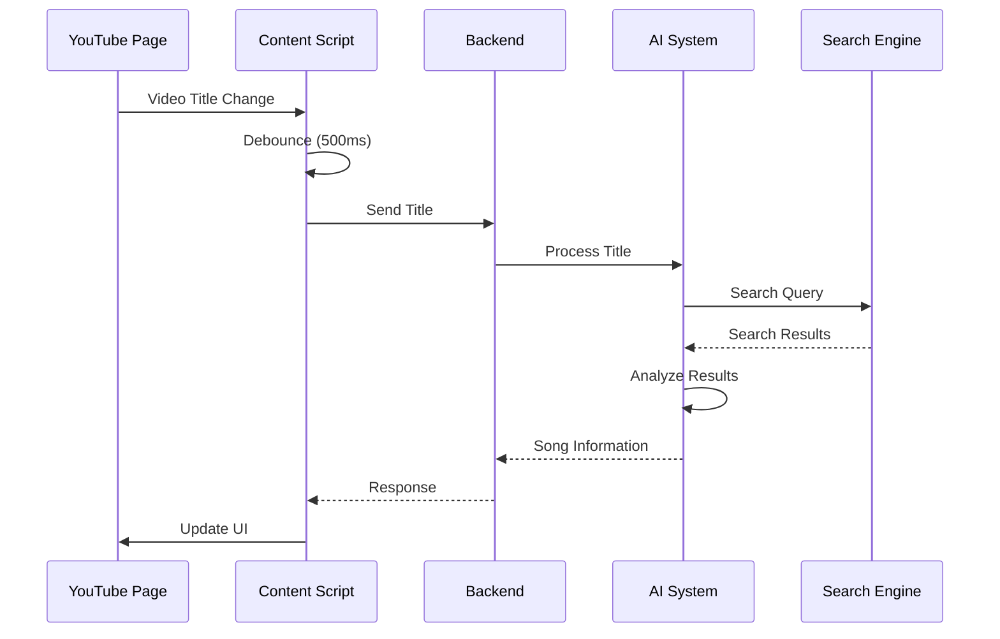
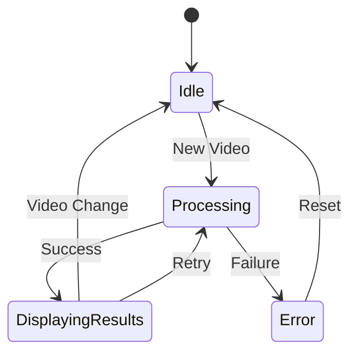
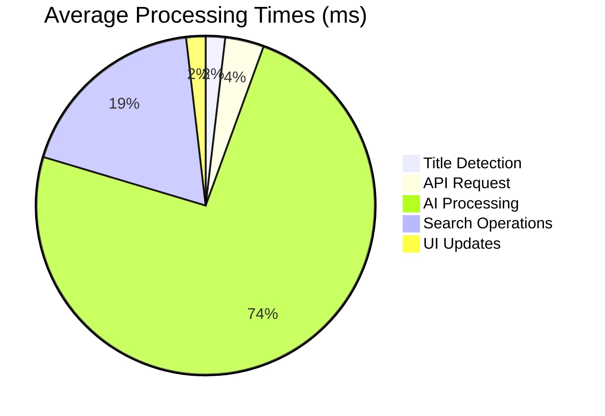
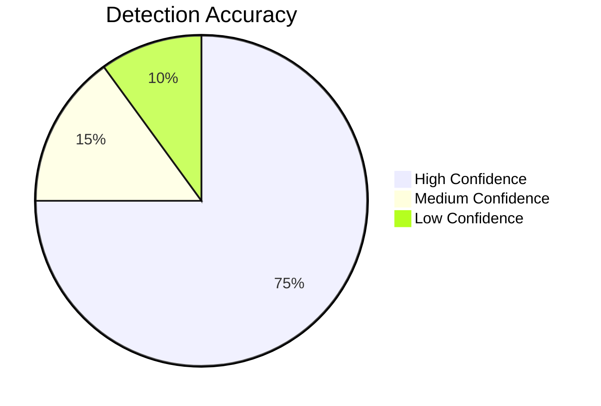
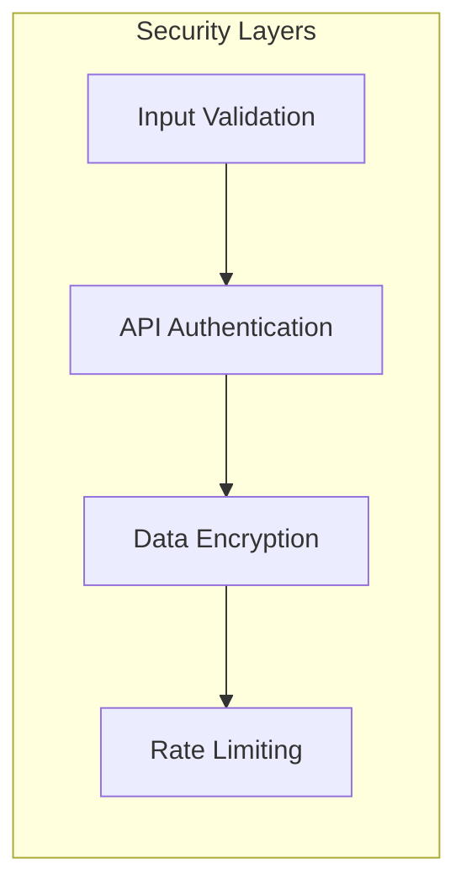
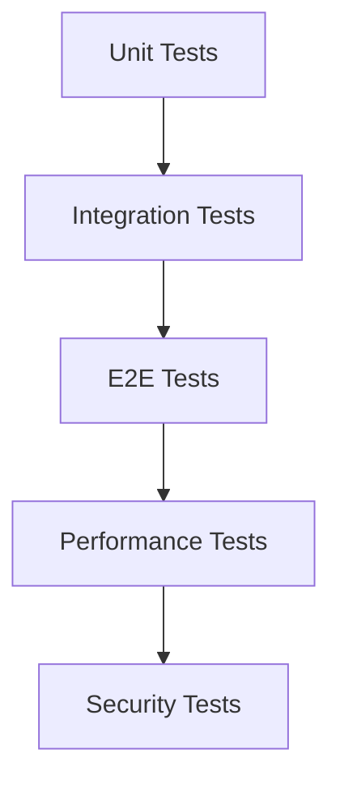
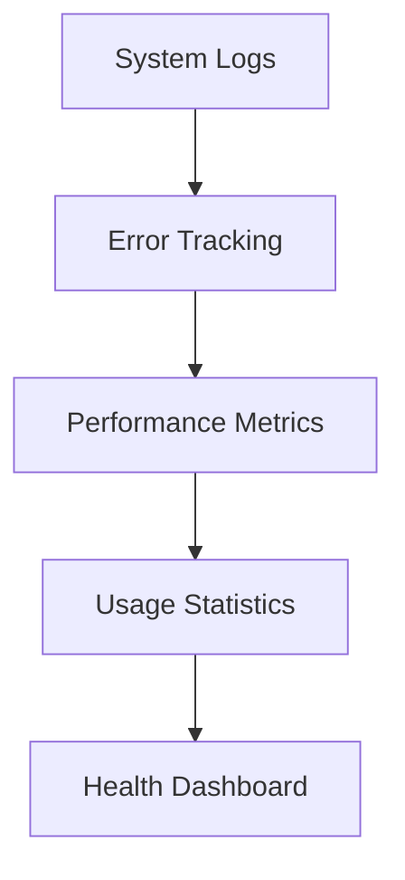
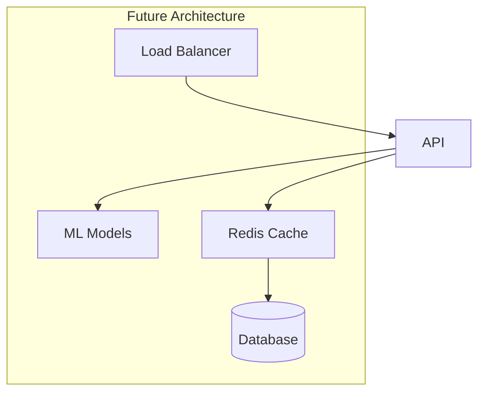

# BeatScript - YouTube Music Information Extractor

## Project Overview
BeatScript is a Chrome extension that automatically detects and extracts song information from YouTube videos. It uses advanced AI and web scraping techniques to identify songs and provide accurate metadata.

## Current State
The project is currently in development with core functionality implemented. The system can:
- Detect YouTube video title changes
- Extract song information using AI
- Display results in a sleek side drawer
- Handle various video title formats
- Manage state across page navigations

## Architecture

### System Components

### Component Details
1. **Frontend Components**
   - Content Script: Monitors YouTube page changes
   - Background Script: Manages extension state
   - UI Components: Drawer interface for results

2. **Backend Components**
   - FastAPI Server: RESTful API endpoints
   - AI Processing: CrewAI-based task processing
   - Web Scraping: DuckDuckGo search integration

3. **External Services**
   - OpenAI GPT-3.5: Natural language processing
   - Search Engine: Web search functionality

## Workflow

### Song Detection Process

### State Management

## Technical Stack

### Frontend
- JavaScript (ES6+)
- Chrome Extension APIs
- Custom CSS with animations
- Event-driven architecture

### Backend
- Python 3.8+
- FastAPI framework
- CrewAI for task orchestration
- BeautifulSoup4 for web scraping

### AI Components
- OpenAI GPT-3.5 Turbo
- Custom prompt engineering
- Multi-agent system architecture

## Current Features

### Core Functionality
- [x] Automatic video detection
- [x] AI-powered song extraction
- [x] Real-time UI updates
- [x] Responsive drawer interface
- [x] Error handling
- [x] State persistence

### UI/UX
- [x] Smooth animations
- [x] Resizable drawer
- [x] Settings menu
- [x] Loading states
- [x] Error messages
- [x] Clean typography

### Backend Processing
- [x] Async request handling
- [x] Multi-stage processing
- [x] Search result analysis
- [x] Confidence scoring
- [x] Result validation

## Development Roadmap

### Short-term Goals
- [ ] Implement caching system
- [ ] Add offline mode support
- [ ] Enhance error recovery
- [ ] Improve search accuracy

### Medium-term Goals
- [ ] Add music database integration
- [ ] Implement user accounts
- [ ] Add playlist features
- [ ] Enhance UI customization

### Long-term Goals
- [ ] Machine learning model training
- [ ] Multiple platform support
- [ ] API marketplace
- [ ] Community features

## Performance Metrics

### Response Times

### Accuracy Metrics

## Security Measures

### Implementation
- Environment variable management
- API key protection
- Rate limiting
- Error logging
- Input sanitization

### Data Flow Security

## Testing Strategy

### Test Coverage
- Unit tests for core functions
- Integration tests for API
- End-to-end testing
- UI component testing
- Performance testing

### Testing Flow

## Contribution Guidelines

### Development Process
1. Fork repository
2. Create feature branch
3. Implement changes
4. Write tests
5. Submit pull request

### Code Standards
- ESLint configuration
- Python PEP 8
- Type hints
- Documentation requirements
- Test coverage requirements

## Installation

### Prerequisites
- Node.js 14+
- Python 3.8+
- Chrome browser
- OpenAI API key

### Setup Steps
1. Clone repository
2. Install dependencies
3. Configure environment
4. Build extension
5. Load in Chrome

## Usage Instructions

### Basic Usage
1. Install extension
2. Navigate to YouTube
3. Play any video
4. View song information

### Advanced Features
- Drawer resizing
- Settings configuration
- Manual refresh
- Error recovery

## Monitoring and Logging

### System Health

## Future Enhancements

### Planned Features
1. Music recommendation system
2. Social sharing capabilities
3. Advanced search options
4. Custom themes
5. Mobile support

### Architecture Evolution

## Conclusion
BeatScript represents a sophisticated approach to music information extraction from YouTube videos. The project combines modern web technologies, AI capabilities, and user-centric design to provide a seamless experience for music discovery and information retrieval.

---
*Last Updated: [Current Date]*
*Version: 1.0.0* 